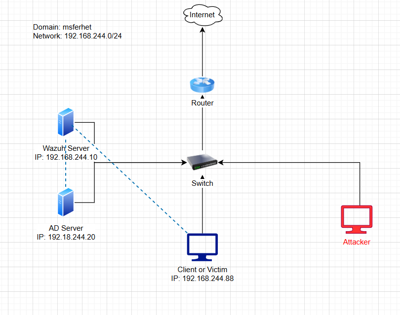

# Active Directory Domain Control Project

## Objectives
1. Build an Active Directory (AD) domain and configure it as a secure environment.
2. Integrate Sysmon and Splunk for monitoring and logging.
3. Create an attacker virtual machine using Kali Linux and simulate attacks on the AD domain.
4. Investigate the simulated attacks and generate detailed reports.

## Step By Step Guide
### Step 1: Create the Project Diagram

Summary of the Diagram:
The provided network diagram represents the architecture of an Active Directory (AD) domain environment. It includes the following components:

**Domain Information:**
- Domain Name: msferhet
- Network: 192.168.244.0/24

**Components:**
1. Router: Connects the internal network to the internet.
2. Switch: Facilitates communication between devices within the network.
3. Wazuh Server: IP 192.168.244.10, used for security monitoring and log analysis.
4. AD Server: IP 192.168.244.20, serves as the Active Directory domain controller.
5. Client or Victim Machine: IP 192.168.244.88, represents a user or endpoint in the domain.
5. Attacker Machine: Simulates an external or internal threat actor.

## Tools and Technologies
- Windows Server
- VirtualBox/VMware
- PowerShell
- Sysmon
- Splunk
- Kali Linux
- Wireshark (for network monitoring)

## Resources
- [Microsoft Learn: Active Directory](https://learn.microsoft.com/en-us/windows-server/identity/active-directory-domain-services)
- [Sysmon Documentation](https://learn.microsoft.com/en-us/sysinternals/downloads/sysmon)
- [Splunk Documentation](https://docs.splunk.com/)
- [Kali Linux](https://www.kali.org/)
- [Cybersecurity Labs](https://www.cybrary.it/)
